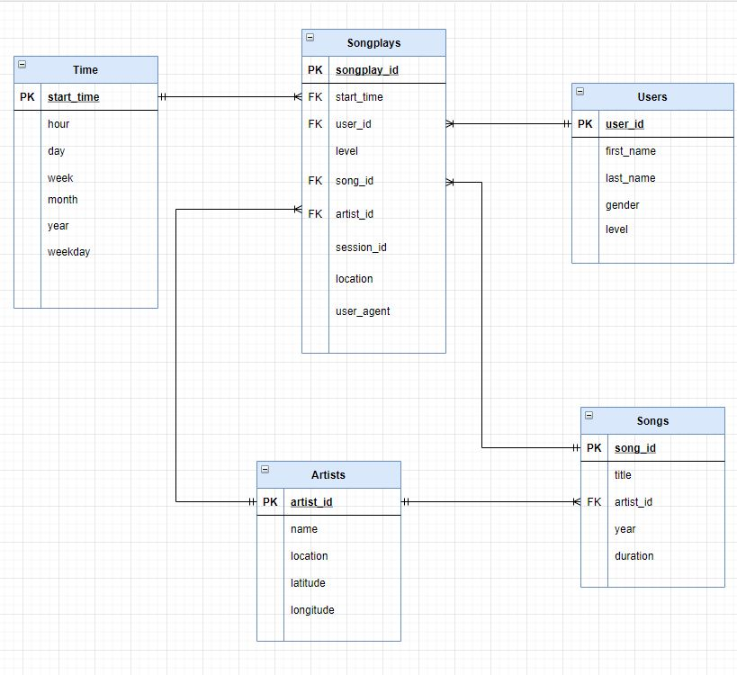
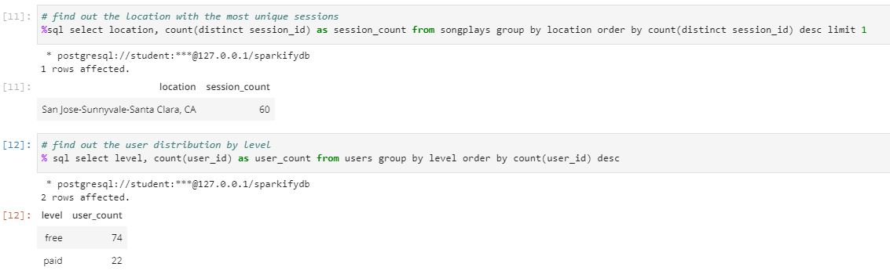

## Table of contents
* [Project Introduction](#project-intro)
* [Technologies](#technologies)
* [Database Schema](#dbschema)
* [ETL Pipeline](#etl)
* [Steps to create table & ETL process](steps)
* [Query Examples](qexamples)

## Project Introduction

This project is designed for building a Postgre Database & ETL process for a startup company -- Sparkify that has been collecting songs and user activity on their new music streaming app. The Database along with the ETL process will help their analytics team to understand what songs users are listening to and provide the team an easy way to query the data, which is now residing a directory of JSON logs on the user activity on the app, as well as a directory with JSON metadata on the songs in their app

	
## Technologies
Project is created with:
* psycopg2
* Python
* PostgreSQL
* Pandas

	
## Database Schema

Using the song and log datasets, you'll need to create a star schema optimized for queries on song play analysis. This includes the following tables.

#### Fact Table
* songplays - records in log data associated with song plays i.e. records with page NextSong.
   fields include: songplay_id, start_time, user_id, level, song_id, artist_id, session_id, location, user_agent

#### Dimension Tables
* users - users in the app
   fields include: user_id, first_name, last_name, gender, level
* songs - songs in music database
   fields include: song_id, title, artist_id, year, duration
* artists - artists in music database
   fields include: artist_id, name, location, latitude, longitude
* time - timestamps of records in songplays broken down into specific units
   fields include: start_time, hour, day, week, month, year, weekday




#### Table Creation Script
* Script location: sql_queries.py
* example--songplays: 

```
    songplay_table_create = ("""
    create table if not exists songplays (
        songplay_id SERIAL primary key,
        start_time timestamp,
        user_id int,
        level varchar,
        song_id varchar,
        artist_id varchar, 
        session_id int,
        location varchar,
        user_agent varchar,
         CONSTRAINT fk_user
           FOREIGN KEY(user_id) 
              REFERENCES users(user_id),
        CONSTRAINT fk_time
           FOREIGN KEY(start_time) 
              REFERENCES time(start_time),
        CONSTRAINT fk_song
           FOREIGN KEY(song_id) 
              REFERENCES songs(song_id),
        CONSTRAINT fk_artist
           FOREIGN KEY(artist_id) 
              REFERENCES artists(artist_id)

    )

    """)
```

## ETL Pipeline

#### Data Source
* song_data: JSON metadata on the songs in the Sparkify app & located at data/song_data
* log_data: JSON logs on user activity on the Sparkify app & located at data/log_data

#### Functions & Code blocks source:
* Script location: sql_queries.py & etl.py
* Load json files from the data source directory: function process_data

#### Process Song_Data

* create a dataframe for each song_data json file
* function: process_song_file

1. **Prepare artists table**
* select artists related fields from each single dataframe  
* convert the array to list of values 
* insert the list of values to the artists table using artist_table_insert script

```
  above steps are defined in etl.py as:
    artist_data = df[['artist_id','artist_name','artist_location','artist_latitude','artist_longitude']].values[0].tolist()
    cur.execute(artist_table_insert, artist_data)
```

* artist_table_insert script in sql_queries.py:

```
    artist_table_insert = ("""
    insert into artists (artist_id, name, location, latitude, longitude) values (%s, %s, %s, %s, %s) 
    
    ON CONFLICT (artist_id) 
    DO NOTHING;
    """)
```

* Note: prepare artists table before songs table to aviod foreign key conflict during inserting

2. **Prepare songs table**
* select songs related fields from each single dataframe  
* convert the array to list of values 
* insert the list of values to the songs table using song_table_insert script

```
  above steps are defined in etl.py as:
    song_data = df[['song_id','title','artist_id','year','duration']].values[0].tolist()
    cur.execute(song_table_insert, song_data)

```
* song_table_insert script in sql_queries.py:

```
    song_table_insert = ("""
    insert into songs (song_id, title, artist_id,year,duration) values (%s, %s, %s, %s, %s)
    ON CONFLICT (song_id) 
    DO NOTHING;
    """)
```


#### Process Log_Data

* create a dataframe for each log_data json file & filter by NextSong action
* function: process_log_file

1. **Prepare time table**
* convert timestamp column in the dataframe to datetime
* extract the timestamp, hour, day, week of year, month, year, and weekday from the datetime column into time_data tuple
* define the column labels & create time_df with the time_data and column_labels 
* insert each row of the values from the time_df to time table using time_table_insert script
```
  above steps are defined in etl.py as:
    # convert timestamp column to datetime
    t = pd.to_datetime(df['ts'], unit='ms')
    
    # insert time data records
    time_data = (t, t.dt.hour, t.dt.day, t.dt.week, t.dt.month, t.dt.year, t.dt.weekday)
    column_labels = ("timestamp","hour","day","week","month","year","weekday")
    time_df = pd.DataFrame(dict(zip(column_labels,time_data)))

    for i, row in time_df.iterrows():
        cur.execute(time_table_insert, list(row))
```   
* time_table_insert script in sql_queries.py:
```  
    time_table_insert = ("""
    insert into time ( start_time ,
        hour ,
        day ,
        week ,
        month ,
        year , 
        weekday ) values (%s, %s, %s, %s, %s, %s, %s)
        ON CONFLICT (start_time) 
        DO NOTHING;
    """)
```


2. **Prepare users table**
* select users related fields from each single dataframe as defined in user_df
* insert each row of values from the user_df to users table using user_table_insert script
``` 
  above steps are defined in etl.py as:
    # load user table
    user_df = df[['userId','firstName','lastName','gender','level']]
  
    # insert user records
    for i, row in user_df.iterrows():
        cur.execute(user_table_insert, row)
```  
* user_table_insert script in sql_queries.py:
```  
    user_table_insert = ("""
    insert into users (user_id, first_name, last_name, gender, level) values (%s, %s, %s, %s, %s)
    ON CONFLICT (user_id) 
    DO NOTHING;
    """)
``` 

3. **Prepare songsplay table**
* In order to get the ID for the song and artist, we will need to query against the songs and artists table to find matches based on song title, artist name, and song duration time.
* the song_select statement in sql_queries.py defines the above query:
``` 
    song_select = ("""
    select songs.song_id, songs.artist_id from songs join artists on songs.artist_id=artists.artist_id

    where songs.title=%s and artists.name=%s and songs.duration=%s  

    """)
``` 
* insert the songsplay related fields from the initial dataframe filtered by NextPage action and the song_id & artist_id from the result above to the songsplay table:
``` 
  above steps are defined in etl.py as:
    # insert songplay records
    for index, row in df.iterrows():
        
        # get songid and artistid from song and artist tables
        cur.execute(song_select, (row.song, row.artist, row.length))
        results = cur.fetchone()
        
        if results:
            songid, artistid = results
        else:
            songid, artistid = None, None

        # insert songplay record
        songplay_data =  (pd.to_datetime(row.ts, unit='ms'), row.userId, row.level, songid, artistid, row.sessionId, row.location, row.userAgent)
        cur.execute(songplay_table_insert, songplay_data)
```  
* songplay_table_insert script in sql_queries.py:
```  
    songplay_table_insert = ("""

    insert into songplays (
        start_time,
        user_id ,
        level ,
        song_id ,
        artist_id , 
        session_id ,
        location ,
        user_agent ) values ( %s, %s, %s, %s, %s, %s, %s, %s)
    """)
``` 


## Steps to create table & ETL process

* run create_table.py to create the Database & all tables
* run etl.py for ETL process

## Query Examples

Here are two query examples located in test.ipynb:


