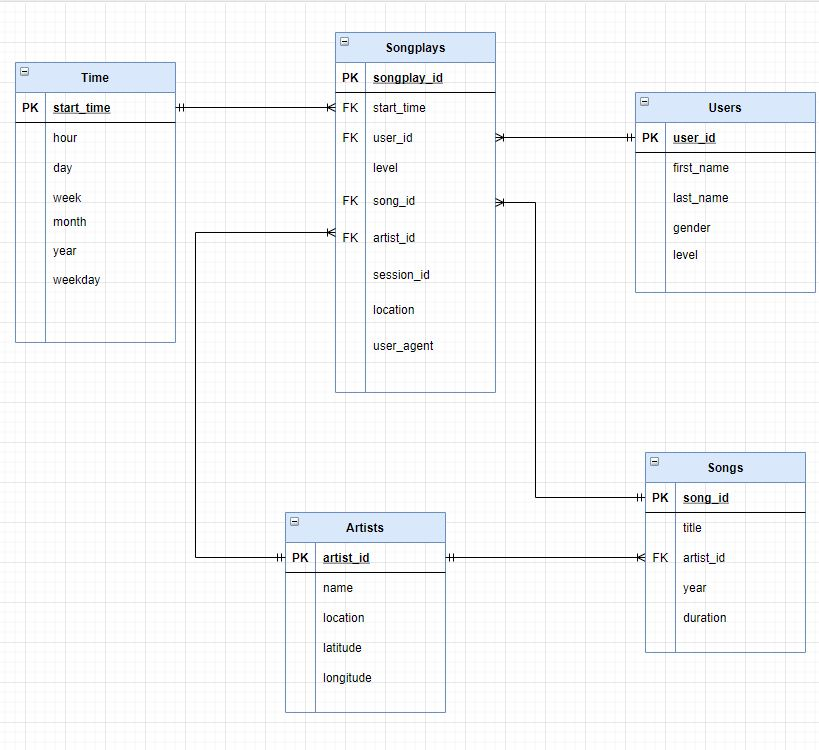
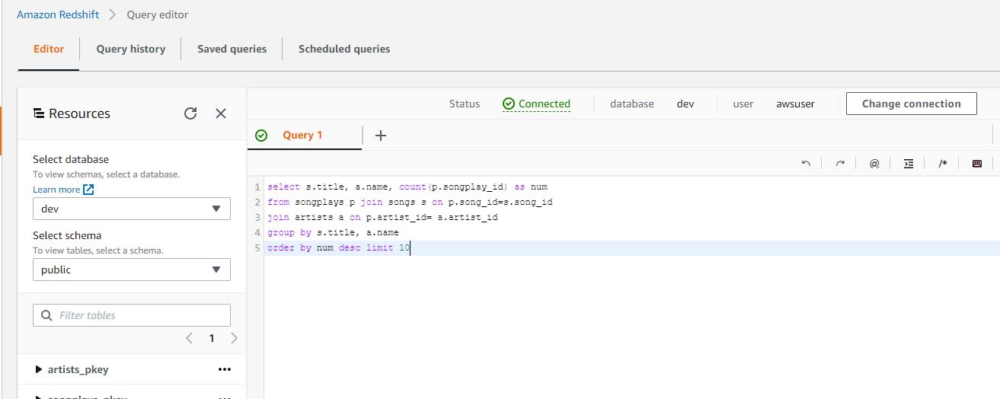
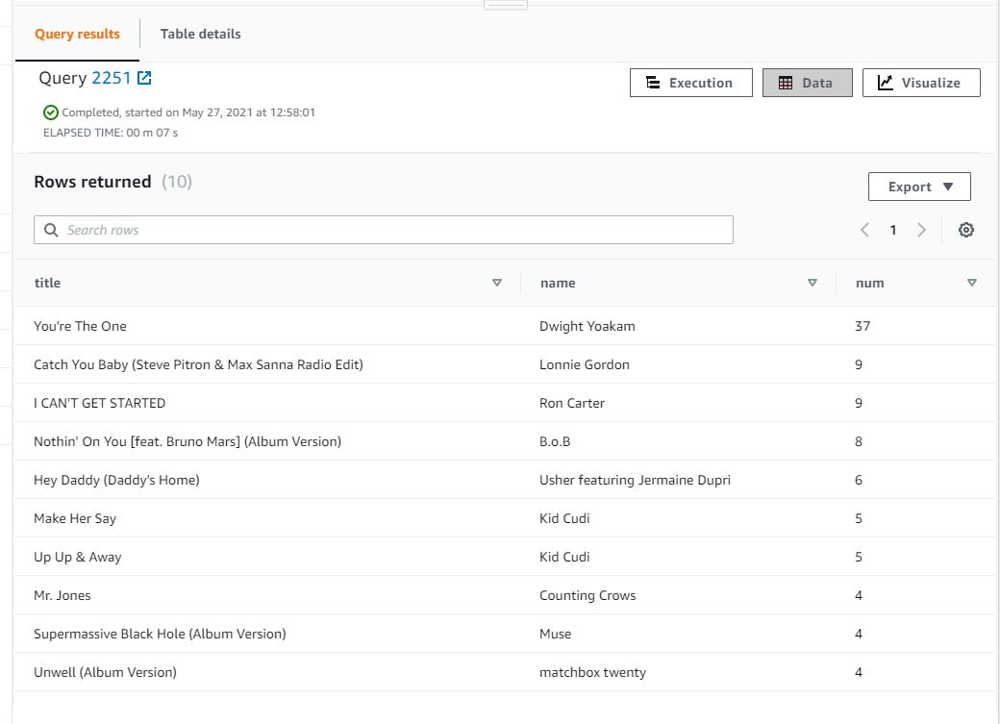

## Table of contents
* [Project Introduction](#project-intro)
* [Technologies](#technologies)
* [Database Schema](#dbschema)
* [ETL Pipeline](#etl)
* [Steps to create table & ETL process](steps)
* [Query Examples](qexamples)

## Project Introduction

This project is designed to help a startup company -- Sparkify that has grown their user base and song database to move their processses and data onto the cloud. Currently they have the data resides in S3, in a directory of JSON logs on user activity on the app, as well as a directory with JSON metadata on the songs in their app.

In this project, we will build an ETL pipeline that extracts Sparkify's data from S3, stages them in Redshift, and transfors data into a set of dimensional tables for Sparkify's analytics team to continue finding insights in what songs their users are listening to.


	
## Technologies
Project is created with:
* configparser
* Python
* psycopg2

	
## Database Schema

#### Project Datasets
* Song data: s3://udacity-dend/song_data
* Log data: s3://udacity-dend/log_data
* Log data json path: s3://udacity-dend/log_json_path.json


#### Staging Tables
We will load the data from S3 to two staging tables on Redshift:
* staging_events
* staging_songs

The purpose of the staging tables is to better prepare the transformation process for loading data to the analytcis table on Redshift.


Using the song and log datasets, we'll need to create a star schema optimized for queries on song play analysis. This includes the following tables.

#### Fact Table
* songplays - records in log data associated with song plays i.e. records with page NextSong.
   fields include: songplay_id, start_time, user_id, level, song_id, artist_id, session_id, location, user_agent

#### Dimension Tables
* users - users in the app
   fields include: user_id, first_name, last_name, gender, level
* songs - songs in music database
   fields include: song_id, title, artist_id, year, duration
* artists - artists in music database
   fields include: artist_id, name, location, latitude, longitude
* time - timestamps of records in songplays broken down into specific units
   fields include: start_time, hour, day, week, month, year, weekday

Here is the ERD:




#### Table Creation Script
* Script location: sql_queries.py

Total of 7 tables are created:
* staging_events
* staging_songs
* songplays
* users
* songs
* artists
* time


* example--songplays: 

```
    songplay_table_create = ("""
    create table if not exists songplays (
        songplay_id SERIAL primary key,
        start_time timestamp,
        user_id int,
        level varchar,
        song_id varchar,
        artist_id varchar, 
        session_id int,
        location varchar,
        user_agent varchar,
         CONSTRAINT fk_user
           FOREIGN KEY(user_id) 
              REFERENCES users(user_id),
        CONSTRAINT fk_time
           FOREIGN KEY(start_time) 
              REFERENCES time(start_time),
        CONSTRAINT fk_song
           FOREIGN KEY(song_id) 
              REFERENCES songs(song_id),
        CONSTRAINT fk_artist
           FOREIGN KEY(artist_id) 
              REFERENCES artists(artist_id)

    )

    """)
```

## ETL Pipeline

#### Load staging tables
* Script location: sql_queries.py & etl.py
* Function defined in etl.py: load_staging_tables
* Copy table query example in sql_queries.py:
```
    staging_events_copy = ("""

    COPY staging_events FROM {}
    CREDENTIALS 'aws_iam_role={}'
    REGION 'us-west-2'
    JSON AS {}

    """).format(config.get('S3','LOG_DATA'), config.get('IAM_ROLE','ARN'),   config.get('S3','LOG_JSONPATH'))
```


#### Insert values from staging tables to the analytics tables
* Script location: sql_queries.py & etl.py
* Function defined in etl.py: insert_tables
* Insert table query example in sql_queries.py:
```
    user_table_insert = ("""
    insert into users (user_id, first_name, last_name, gender, level) 
    select distinct userId as user_id, firstName as first_name, lastName as last_Name, gender, level from staging_events where user_id <> NULL
        order by user_id

    """)
```


## Steps to create table & ETL process

* run create_table.py to create the Database & all tables
* run etl.py for ETL process

## Query Examples

Here is one query example on Redshift query editor to show the most popular 10 songs with the artist names played:




